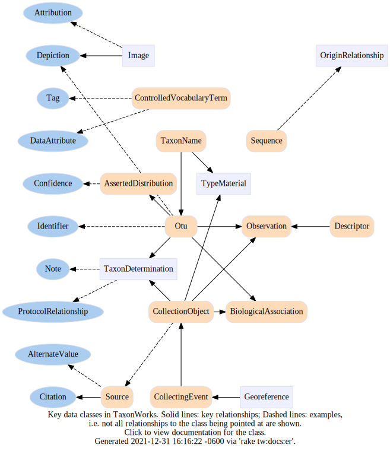

# Data model
_Answer the question "What does the data-store in TaxonWorks look like, and what is the thought behind how it came to be?"_

## Key classes
At its core TaxonWorks' data model has a handfull of key concepts (orange nodes below) with straightforward meaning.
* TaxonName - about nomenclature
* Collection objects - about specimens 
* Otu - about speices, e.g. their biology and distribution
* Observations - data about CollectionObjects or Otus, e.g. characters or measurements
* Descriptors - classes of observations
* Asserted distributions - the distribution of OTUs according to the literature
* Biological associations - 

_Nodes are clickable, they will open in a new page._

### Meta-model
TaxonWorks uses an "ontology-based, graph-aware, relational database" approach to representing and storing data. Practically speaking this means several things:
* Each Data table (see below) corresponds to a class of data. A record in that table asserts that an single instance of that class exists. This is the "Ontology" bit.
* When useful data are organized into graph (network-based, i.e. nodes, edges, and their attributes) patterns ammenable to down-stream migration into graph databases (e.g. [TaxonNames](), [BiologicalAssociations]())
* Tables are named exactly as the class is named, in a pluralized format (e.g. the class `TaxonName` is stored in table [`taxon_names`]()).
* Some classes of data have subclasses (e.g. [BiologicalCollectionObject]() is a subclass of [CollectionObject]() and [Specimen]() is a subclass of [BiologicalCollectionObject].  Each subclass adds assertions as to what the thing being represented is. Subclass assertions are stored in the field `type` (e.g. [CollectionObject](tables link).
* Some classes of data are "polymorphic", particularly annotators (see below).  This means that one table references many other tables by a combination of `<object>_type` and `object_id`.

There are well known arguments as to when/how each aspect of this approach breaks down or fails in certain circumstances.

In addition to the indvidual table-class approach there are several higher-level classes, used to carefully isolate the differences between users, the data they curatore, and how those data are displayed and presented:
* Data - The properties of things in TaxonWorks.  When designing our data-store we strive to eliminate, or minimize all fields that describe how we display or see Data (see below).  Data are further classified, more for the purposes of utility than meaning, into three categories:
  * Core - 
  * Supporting - 
  * Annotation - General classes of annotations that can be applied to most Core and Supporting
* Project - Describes Users, and Projects, i.e. manages who can curate what data.
* UI/Display/Layout - Tables that define how we display, visualize, or present Data.

When customizing or adapting TaxonWorks to your needs, maintaing this seperate of concerns will faciliate the long term integrity of your data. For example, you can create custom attributes for Data classes via [DataAttributes](), these attributes should describe the things they are tied to, not just what "I want to see on some page".

## Database schema

* For an auto-generated schema in text see [db/schema.rb](https://github.com/SpeciesFileGroup/taxonworks/blob/development/db/schema.rb)
* The model is reflected closely in the code, see [code documenation here](https://rdoc.taxonworks.org/)

## Tables

## 

